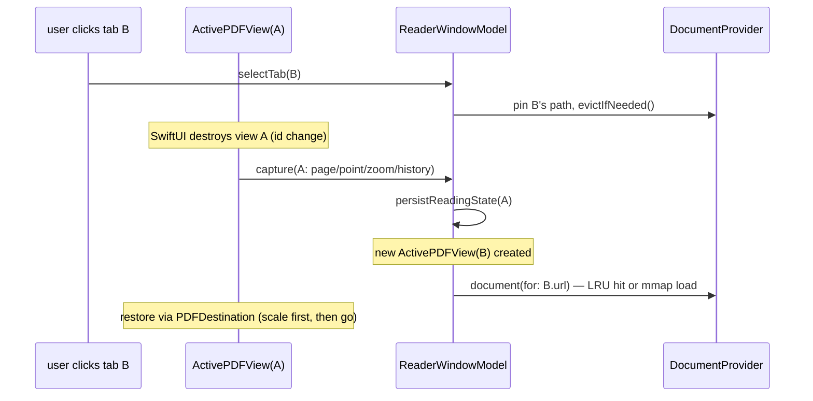

# Architecture

For milestone status see [PROGRESS.md](PROGRESS.md); for why things are the
way they are see [DECISIONS.md](DECISIONS.md); for planned work see
[BACKLOG.md](BACKLOG.md).

## Module map

All logic lives in the root SwiftPM package (testable with plain `swift
test`); the app targets in `App/` are thin shells over it.

```mermaid
graph TD
    subgraph "App targets (App/PDFReader.xcodeproj)"
        MAC["PDFReader (macOS)\nApp/macOS — scene + delegate only"]
        IOS["PDFReader-iOS\nApp/iOS — own SwiftUI views (part 1)"]
    end
    subgraph "SwiftPM package (Sources/)"
        RUI[ReaderUI\nmacOS SwiftUI views, view models,\nPDFKit wrappers — all #if os(macOS)]
        RC[ReaderCore\nTabState, NavigationHistory,\nSessionSnapshot+Codec, AppTheme\nPURE, cross-platform]
        RP[ReaderPersistence\noverlay library.db via GRDB:\nbooks, tags, collections,\nbookmarks, reading state]
        CK[CalibreKit\nread-only metadata.db access]
        SIK[SearchIndexKit\nFTS5 index.db + OCR extraction]
        SYK[SyncKit\nCloudKit sync — STUB, M15]
    end
    MAC --> RUI
    IOS --> RC
    RUI --> RC & RP & CK & SIK & SYK
    RP --> RC
    SYK --> RP
    CLI1[calibre-ls CLI] --> CK
    CLI2[pdfindex CLI] --> SIK
```

Only external dependency: **GRDB.swift** (SQLite + FTS5 + migrations).

## The memory model (requirement #1)

10+ GB of open books must not mean 10+ GB of RAM. Three rules:

1. A **tab is data** (`ReaderCore.TabState`): file path/bookmark, page,
   zoom, display mode, and its own back/forward history. Codable, ~bytes.
2. **Live `PDFDocument`s** are scarce: `DocumentProvider` (ReaderUI) holds a
   small LRU (default 3) keyed by canonical path, ref-shared across tabs on
   the same file, with the active tab's document pinned. `PDFDocument(url:)`
   memory-maps, so even a resident 500 MB book costs little until rendered.
3. **Only the active tab has a `PDFView`** — the tile/render caches live in
   the view, and destroying the view is the only reliable way to release
   them. `ActivePDFView` is keyed `.id(tab.id + theme)`; on teardown it
   captures the exact position back into TabState, on creation it restores.

Measured: 10 textbooks open = 66 MB footprint; 5 tabs of one book ≈ 1.6× one.



## Navigation & history

`ReaderCore.NavigationHistory` (per tab) is the **single source of truth**
for back/forward — never `PDFView.goBack`. Pushed by: internal link clicks,
outline clicks, search-result clicks, page-jump field. NOT pushed by
scrolling (`PDFViewPageChanged` only updates `tab.pageIndex` for crash-safe
restore and the sidebar highlight).

Internal links: PDFKit's delegate never fires for GoTo links, so
`ReaderPDFView` (a PDFView subclass) overrides `mouseDown`, resolves
`PDFActionGoTo` / `PDFActionRemoteGoTo` / bare `annotation.destination`
(hyperref emits those), and routes through the model. Plain click = history
push + in-place jump; ⌘-click = new tab inserted adjacent to the source tab;
remote-file links = new tab on the other PDF.

## Windows & session

- `SessionCoordinator` (singleton) owns every window's `ReaderWindowModel`
  and ONE shared `DocumentProvider`. Debounced (1s) atomic writes of a
  versioned `session.json` (`ReaderCore.SessionCodec`, schemaVersion +
  oldest-first migrations); flush on terminate via `applicationShouldTerminate`.
- `WindowAccessor` applies NSWindow policy: `.moveToActiveSpace` (windows
  open in the CURRENT Space — a core requirement), `tabbingMode=.disallowed`
  (we draw our own tab strip), `isRestorable=false` (no fight with system
  restore; the scene also sets `.restorationBehavior(.disabled)`).
- Launch: the default scene adopts the first restored window, then fans out
  `openWindow` for the rest — no bootstrap-window hack.
- Tabs drag between windows: payload `"windowID|tabID"` →
  `SessionCoordinator.moveTab` (state + history travel).
- `PDFREADER_SESSION_DIR` env var isolates all app data (session.json,
  library.db, index.db) for tests/XCUITest.

## Data stores

| Store | Location (AppDataDirectory) | Contents | Synced? |
|---|---|---|---|
| session.json | versioned JSON | windows → tabs → positions/history | no (device-local) |
| library.db | GRDB, migrations v1+v2 | book (calibre_uuid XOR content_hash identity), hierarchical tag + collection (parent_id), book_tag, collection_item, user_bookmark, reading_state; all synced tables carry modified_at + soft-delete deleted_at; file_ref is LOCAL-ONLY | M15 via CloudKit |
| index.db | GRDB | indexed_doc (content_hash, extractor_version) + page_fts (FTS5 unicode61 remove_diacritics 2) | no (rebuildable) |
| Calibre metadata.db | user's folder | READ-ONLY, never opened live: NSFileCoordinator copy → read the copy | n/a (Calibre owns it) |

**Book identity**: Calibre books = `calibre_uuid`; anything else =
`content_hash` (SHA-256 of first 128 KiB + file size — survives moves).
`BookResolver` maps any opened file to its book row (hash → file_ref path →
auto-register), so bookmarks/reading-state work for every PDF.

## Search

- In-document: PDFKit `beginFindString` streaming into `FindController`;
  results listed in the sidebar (typing never navigates; click = jump+push).
- Library-wide: `IndexingService` actor extracts text per page (background,
  local files only, cancellable) into FTS5. Pages with no text layer are
  rendered at ~200 DPI and OCR'd with Vision (`extractor_version = 2`;
  bumping it re-indexes everything). Math notation extracts imperfectly —
  treated as best-effort.

## Theming

`ThemeManager` (UserDefaults-persisted) + `ThemedPDFPage` installed on every
document via `PDFDocumentDelegate.classForPage`. Page filtering is done with
blend modes in `draw(with:to:)` — dark = difference-invert, sepia = multiply
`#F5EDE1` — because that path works on BOTH macOS and iOS (CALayer.filters
does not). `PageFilterStore` is a lock, not MainActor state: PDFKit draws
tiles off-main. Theme switch rebuilds the PDFView (its `.id` includes theme).

## CloudKit sync design (M15, not yet implemented)

CKSyncEngine, private DB, one custom zone. Deterministic record names
(calibre uuid / content hash / relation-key concatenations) so devices mint
identical records — no dedup pass. Conflicts: LWW by modified_at;
reading_state = max(updatedAt) wins. Local-only: session, index, file_ref.
Everything behind a `SyncTransport` protocol so the app runs sync-less and
tests use a fake. Team ID A448YLFLYC is set on the project.

## Testing & verification patterns

- Fixtures are GENERATED in-test (SQL for Calibre DBs, CGContext+CoreText
  PDFs, bitmap-only "scanned" PDFs) — zero binaries in git.
- `ActivePDFControlling` protocol seam lets navigation tests use a fake view.
- Theming tests render through `PDFPage.draw(with:to:)` and assert pixels
  (thumbnail APIs bypass the subclass override — don't use them for this).
- App-level verification: build with xcodebuild, launch the binary with
  `--open <pdf>` (repeatable) + `PDFREADER_SESSION_DIR`, check
  `footprint`/pgrep, quit via AppleScript. iOS: simulator + simctl screenshot.
